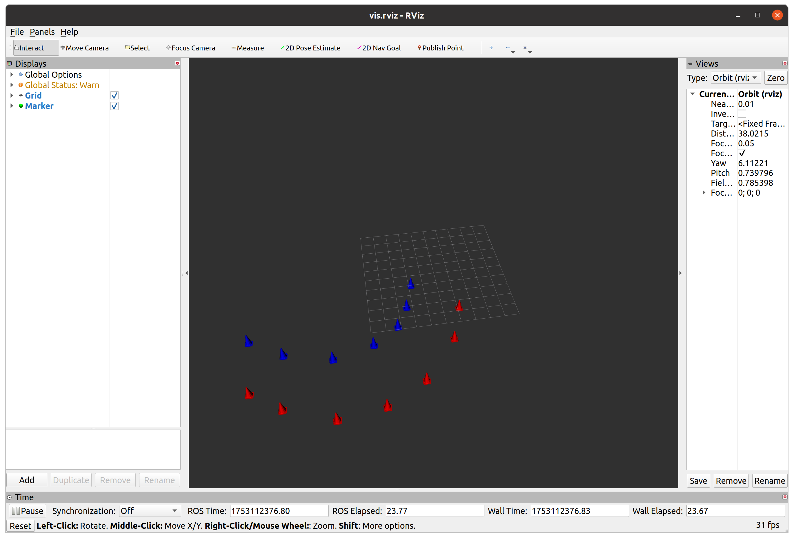

https://github.com/fenghonghao/26-wuren-fenghonghao/tree/main/hw_ros_ws

# 编译安装

```
catkin build
source devel/setup.bash
```

# 1. hwpkg对应基础作业

scripts/pubspeed.py 为获取自定义消息并且发布，消息类型为turtlespeed

ParamClient.cpp 订阅turtlespeed，并发布geometry/Twist到turtle1/cmd_vel话题

使用

```
roslaunch hwpkg turtle.launch
```

小乌龟效果


消息发布截图，其中/pubspeed/turtlespeed是自定义消息发布的话题


rqt_graph


查看效果

# 2. conecounter对应进阶作业

urdf模型还没试过，问了airviz可以用[这个](https://wiki.ros.org/rviz/Tutorials/Markers%3A%20Basic%20Shapes)可视化，就不用urdf了。

程序还面向过程，有空改

没有oodm，直接拿rslidar来做原点了

使用

```
rosluanch conecounter counter.cpp
```

查看效果

